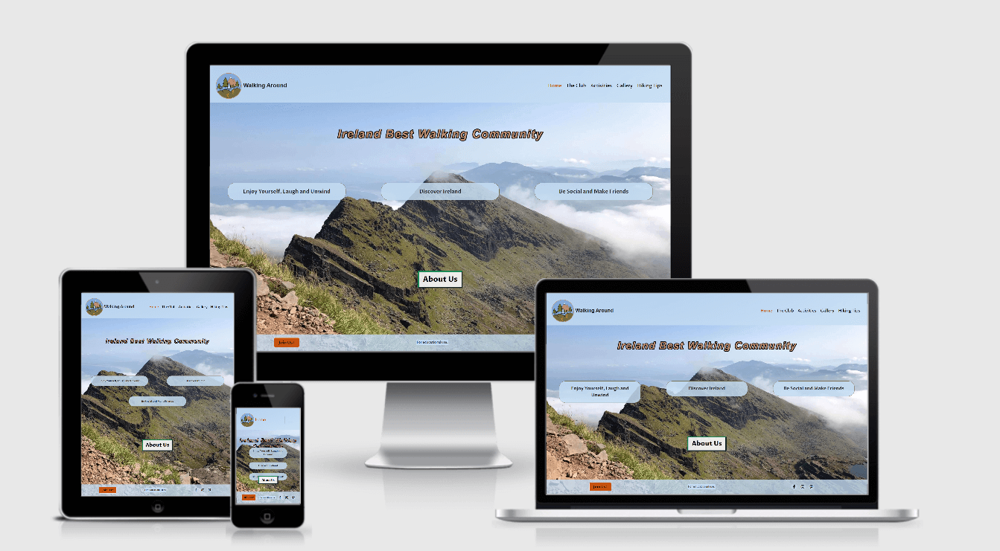
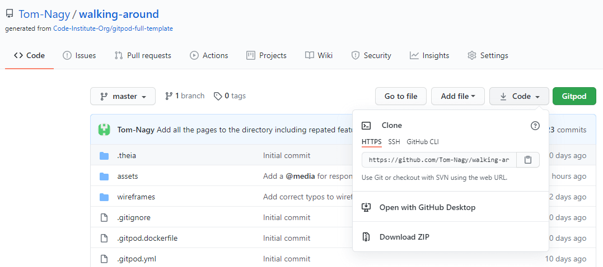
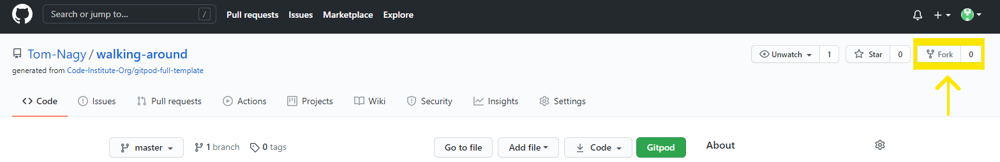

# **Walking Around**



Check out the other mockup:
* [The club](assets/images/README-images/ami-responsive-theclub.png)
* [Activities](assets/images/README-images/ami-responsive-activities.png)
* [Gallery](assets/images/README-images/ami-responsive-gallery.png)
* [Hiking Tips](assets/images/README-images/ami-responsive-hikingtips.png)
* [Join Us !](assets/images/README-images/ami-responsive-join.png)

#### Visit the live Website : **[Walking Around](https://tom-nagy.github.io/walking-around/)**.

Walking Around is a Club situated in Bray (County Wicklow, Ireland). It is a group of people 
from all ages and background that enjoy hiking.  
The Club's members meet regularly to accomplish different types of walks and activities from 
easy to advanced difficulties.

## Table of Content : 

* [Project](https://github.com/Tom-Nagy/walking-around#Project)
    * [Project Goals](https://github.com/Tom-Nagy/walking-around#Project-Goals)
    * [Developer and Business Goals](https://github.com/Tom-Nagy/walking-around#Developer-and-Business-Goals)
    * [User Goals](https://github.com/Tom-Nagy/walking-around#User-Goals)
 * [UX](https://github.com/Tom-Nagy/walking-around#UX)
    * [Audience Definition](https://github.com/Tom-Nagy/walking-around#Audience-Definition)
    * [User Stories](https://github.com/Tom-Nagy/walking-around#User-Stories)
    * [Design Choices](https://github.com/Tom-Nagy/walking-around#Design-Choices)
    * [Wireframes](https://github.com/Tom-Nagy/walking-around#Wireframes)
    * [Different Design](https://github.com/Tom-Nagy/walking-around#Different-Design)
* [Features](https://github.com/Tom-Nagy/walking-around#Features)
    * [Existing Features](https://github.com/Tom-Nagy/walking-around#Existing-Features)
    * [Features to Implement in the Future Versions](https://github.com/Tom-Nagy/walking-around#Features-to-Implement-in-the-Future-Versions)
* [Technologies Used](https://github.com/Tom-Nagy/walking-around#Technologies-Used)
* [Testing](https://github.com/Tom-Nagy/walking-around#Testing)
* [Deployment](https://github.com/Tom-Nagy/walking-around#Deployment)
    * [Live Deployment](https://github.com/Tom-Nagy/walking-around#Live-Deployment)
    * [Local Deployment](https://github.com/Tom-Nagy/walking-around#Local-Deployment)
* [Bugs](https://github.com/Tom-Nagy/walking-around#Bugs)
    * [Solved](https://github.com/Tom-Nagy/walking-around#Solved)
    * [Unsolved](https://github.com/Tom-Nagy/walking-around#Unsolved)
* [Credits](https://github.com/Tom-Nagy/walking-around#Credits)
    

# Project

### Project Goals

This website will **advertise** and **promote** the Club and its activities in 
order to **attract** the audience into **joining** the Club.

### Developer and Business Goals

* Build a static website using HTML and CSS.
* Advertise and Promote the Club by :
  * Providing accurate and useful information.
  * Providing an excellent User Experience (UX).
* Growth of the Club member's population by :
  * Attracting people to join the Club.
  * Using a User Centric Development approach (UCD).

### User Goals

* Learn about the Club :
  * activities.
  * Spirit and Goals.
* Learn about hiking.
* See pictures of the walks.
* Submit an application to join the Club.

# UX

### **Audience Definition**

The targeted audience has no age limits and is interested in hiking. This audience 
would have as well an interest in outdoor activities, sport, healthy living and adventures.

#### The targeted audience for this website is looking for :

* Outdoor activities.
* Being part of a group, a community.
* Discovering Ireland.
* Hiking tips.

#### This website is the best way to answer their needs because :

* It provides a form for people to apply for joining the Club.
* It provides useful tips for hikers.
* It gives inspiration and motivation for outside activities through content and pictures.
* It provides meeting information.
* It gives information about the Club activities.

### **User Stories**

1. As a first time user, I want the website to be appealing.
2. As a first time user, I want the navigation to be easy and intuitive.
3. As a first time user, I want the content to be informative but not overwhelming.
4. As a first time user, I want to understand immediately what is the website about 
without the need of looking for it.
5. As a first time user, I want to be able to apply for joining the Club.
6. As a returning user, I want to see when and where are the Club's meetings.
7. As a returning user, I want to check out the different social media links for 
inspiration and ideas.
8. As a returning user, I want to get information about hiking.

### **Design Choices**

#### Fonts

Considering the targeted audience, a sans serif font is best because it is often 
associated to simplicity, modern and clean design. It is as well a flexible font that 
can be paired with the serif style for more formal intention and traditional feel.  
The website will use ***Proza Libre*** font because it has been designed to work 
very well on screen. It will be paired with the ***Cormorant Garmont*** font because 
as [Typewolf](https://www.typewolf.com/blog/google-fonts-combinations) says :
>both designs have a strong calligraphic feel that ties them together.

#### Icons

* FontAwesome icons will be used for better user experience.
* The [logo](assets/images/gallery/logo.png) and [favicon](assets/images/favicon.ico) are the same image for comfort and consistency and use 
the same color scheme as the website.

#### Colors

The [color scheme](assets/images/README-images/colors.png) of the website has been extracted from a picture using [Adobe Color](https://color.adobe.com/create/image) 
and swatches are said to be color blind safe by the same website using the [accessibility tool](https://color.adobe.com/create/color-accessibility).  


As well an orange shade (#C7530F) is used for links. An off white (#FAFAFA) is used for font color. They are distinctive and with a good contrast.

#### Images

The hero image is important for the UX and is large and triggers the will to explore the website.  
A gallery page is part of the website. There will be pictures of scenery, paths and walks.

#### Styling and Feeling

The home page is design to give the feeling of grandiose and adventure.  
The general feel of the website is the love of the outdoor and as well the love 
of sharing moments. This is brought by a simple and clean user interface with 
a lot of space.

### **Wireframes**

* [Desktop](assets/wireframes/desktop.pdf)
* [Tablet](assets/wireframes/tablet.pdf)
* [Mobile](assets/wireframes/mobile.pdf)

### **Different Design**

Some designs are different from the wireframes because of user experience compliance, accessibility, technical skills and time.  

#### Site Map

Activities is a page on its own and not a sub-section of The Club page. This is because of the importance of the content presented in the 
Activities page for the user. And it is now more obvious to find the Activities on the website. It is as well a crucial part of The Club's life.

#### footer

* The ```get in touch``` link have been replace by a ```Join Us``` button. It is more meaningful and describes better one of the 
intention of the website; that is for users to join the club.
* The copyright now says : "For educational use.".

#### Home

* Three headlines have been added to give more information to the user about the website.  
* The ```Join Us``` button have been replaced by ```About Us``` and linked to The Club page. 

#### The Club

* The original idea of having a clip made on Google Earth Studio for the location of the Club in the middle or background of the 
page hasn't been followed because of time issue. This feature was considered significant for the purpose of the website and is now part of the 
future feature to be implemented.
* The first section that describes the Club has now a title that say About Us. It is more meaningful and semantic. It helps users to identify what 
is the section about.
* The second section consisted of inspirational quotes and has been changed to testimonials with a title section (for the same reasons explained 
above) and presents members feedback. It is better practice and it gives more information to the users about the Club.
* The layout of the sections have changed and are one below the other on all screen sizes for better use of the space, design and user experience.

#### Activities

* The icons were replaced by titles for better user experience semantic as it was not considered self-explanatory.

#### Gallery

* The layout of the gallery has change for better user experience. Too many pictures presented was considered confusing and overwhelming.

#### Hiking Tips

* The icons were taken away as it was considered  not a useful feature. The tips titles replaced them for better semantic and readability.
* The layout of the sections have changed and are one below the other on all screen sizes for better use of the space, design and user experience. 
The content is displayed all at once.

#### Join Us !

* The form has now a title and a short explanatory paragraph on the top for better user experience.
* The Heading that appear on large screen is gone and replaced by another inspirational quote.


# Features

### **Existing Features**

#### Repeated Features

On all pages and devices there is a fix header on the top 
and a fix footer on the bottom of the viewport.

**The header** presents the logo and the name of the Website on the 
left and a responsive navigation bar on the right. The navigation 
bar become a toggle on small devices. As well the name of the website 
become the title's page name on small devices in order to help identify on which 
page the user is situated.

**The footer** presents a button with the link "Join Us!" on the 
left that brings the user to the application form.  
As well, social media logos on the right linked to different websites for 
additional information on hiking.
The "copyright" (For educational use) is in the middle with responsive text to fit on small devices. 

All pages feature an image, taking all the viewport. Its purpose is bringing 
the sensation of open space and immersion into Nature.

#### Home

On the home page there is a heading (Ireland Best Walking Community) praising the Club.  
Below the heading there are three headlines that show users what to expect from the Club. 
Below there is a call to action button (About Us). This is to trigger 
users desire to know more about the Club. This button will lead the users to The Club page.

#### The Club

The Club content is displayed in two columns, one below the other.  
The first is the About Us section of the Club and gives explanation about the club and includes a short explanation on how to join with a link to 
the Join Us page.   
The second is the testimonials section. It displays three feedback quotes from the club's members.

#### Activities

The Activities are displayed in three columns.  
From left to right or top to bottom on smaller devices: about the community, the activities, meetings.

#### Gallery

The Gallery presents pictures taken during hikes. It features the great Irish landscape and trails.  
It is presented as a carousel and displays a modal when the image is clicked on to focus on the image and see the images titles and credits. The 
carousel displays one image per slide on small screens and two images per slide on medium and bigger screens.

#### Hiking Tips

On this page are presented three major hiking tips. They are available to download on pdf format by clicking on the download 
icon beside the tip's title. 
Those tips are presented in three columns next to each other on large and medium devices and below each other 
on small devices.  
With each tip two external links are provided for extra information on the subject.

#### Join Us !

This page features a form to fill up in order to apply for joining 
the Club. It is presented on the middle of the screen. 
Beside the form on large screen and on the top on medium screen, motivational quotes will be presented 
to reenforce the emotional response into the action taken.  
On small screens only the form is displayed.

### **Features to Implement in the Future Versions**

#### The Club

Add instead of the background image on large screen a video with [Google Earth](https://www.google.com/intl/fr/earth/) 
to zoom-in the Club location. That would give a wow factor.

#### Gallery

Add responsiveness to the carousel with the number of pictures per slide that changes depending 
on the device size.  
Add some short video and images in the gallery.

#### Join Us !

Provide a functionable link to the form, or a customised error page when clicking the submit button.

#### Additional page

Add a members only page where content about the club is accessible to members only. It would work as a blog and 
displays next hikes; scheduled activities and meetings and a media section with photos and videos.

# Technologies Used 

### Programing Languages

This project uses HTML and CSS.

### Frameworks, Libraries and Programs

* [Balsamiq](https://balsamiq.com/wireframes/)  
For creating wireframes.

* [Bootstrap](https://getbootstrap.com/)  
With the [compiled CSS, JS and CDN](https://getbootstrap.com/docs/4.6/getting-started/download/)  
For the [Grid system](https://getbootstrap.com/docs/4.6/layout/overview/) that provides responsive layout.  
For the various [components](https://getbootstrap.com/docs/4.6/components/alerts/) with built in css.  
JQuery and JavaScript were provided by cdn for responsive elements. They are built in the components used in Bootstrap.

* [Google Fonts](https://fonts.google.com/)  
For importing fonts (***Proza Libre*** and ***Cormorant Garmont***) into the style.css file.

* [Fontawesome](https://fontawesome.com/icons?d=gallery)  
For using icons throughout the website.

* [TinyPNG](https://tinypng.com/) or [Squoosh](https://squoosh.app/)  
For resizing all the images.

* [BeFunky](https://www.befunky.com/create/)
For cropping some of the images.

* [Adobe Color](https://color.adobe.com/create/image)  
For extracting the color scheme used on the website.

* [Am I Responsive?](http://ami.responsivedesign.is/?url=http://ami.responsivedesign.is/#)  
For providing a screenshot of the responsiveness of the website across several devices.

* [Autoprefixer CSS online](https://autoprefixer.github.io/)

* [Git](https://git-scm.com/)  
For Version control.

* [GitPod](https://www.gitpod.io/)  
For Integrated Development Environment.

* [GitHub](https://github.com/)  
For storing the repository.

* [GitHub Pages](https://pages.github.com/)  
For deploying the website live.

# Deployment

This project was developed on [GitPod Workspaces IDE](https://gitpod.io/workspaces/) 
(Integrated Development Environment) committed and pushed to my [Github Repository](https://github.com/Tom-Nagy/walking-around) 
using GitPod Command Line Interface (CLI).

## Live Deployment

To make this website accessible to the public, Walking Around 
has been deployed on [GitHub Pages](https://pages.github.com/) as follow :

1. Log in to my GitHub account.
    * To create an account you need to sign up on [GitHub](https://github.com/).
2. Go to my **Repositories** and select the repository corresponding : [Walking Around](https://github.com/Tom-Nagy/walking-around).
    * To create a repository see [Create a repo](https://docs.github.com/en/github/getting-started-with-github/create-a-repo).
3. Navigate to **Settings** :


4. Scroll down to the **GitHub Pages** section.
5. Click on the **None** dropdown menu and select the branch to publish : **master**.


6. Click on **Save**.
7. The website is now deployed.

The link to the website is found in the **GitHub Pages** section of the repository settings.


## Local Deployment

### Cloning

When a repository is created on GitHub, it is located on GitHub website ("remotely"). 
You can create a copy of the repository locally on your machine. This 
process is called : "**Cloning a repository**".  
When cloning a repository you are actually copying all the data that the repository 
contains at that time to your machine.

To clone a repository, take the following steps :

1. Create a GitHub account.
2. Click on the **Code** dropdown button above the files list.
3. There are three options available to clone the repository :
    * using HTTPS
    * using SSH key
    * using GitHub CLI  



4. Choose an option and copy the link given.
5. Change the current working directory to the location where you want the cloned directory.
5. Open your IDE and in the CLI type : ```git clone``` and paste the link copied on step 4.
>```$ git clone https://github.com/YOUR-USERNAME/YOUR-REPOSITORY```     
6. Press **Enter** to create your local clone.

For further information please go to [Cloning a repository](https://docs.github.com/en/github/creating-cloning-and-archiving-repositories/cloning-a-repository#cloning-a-repository-using-the-command-line).


### Using GitPod

To Clone a repository Using GitPod, take the following steps :

1. Create a GitHub account.
2. Install the GitPod [extension](https://chrome.google.com/webstore/detail/gitpod-dev-environments-i/dodmmooeoklaejobgleioelladacbeki) for Chrome or [Add-on](https://addons.mozilla.org/en-GB/firefox/addon/gitpod/) for Firefox.
3. Navigate to the corresponding repository.
4. Click ont the **GitPod** button on the top right of the files list.
5. This will open a workspace on GitPod where you can work on the repository locally.

>The very first time that you do this, you need to connect GitPod and GitHub together.
You need to log in with GitHub and launch your workspace (As explain above). And then you need to
authorize GitPod to be able to access your GitHub account. You agree to GitPod's
terms and conditions, and then create a free account. Then, it will open the
workspace for you.
Quote from : "Creating a GitPod Workspace" on [Code Institute Full Stack Software Development Programme](https://codeinstitute.net/full-stack-software-development-diploma/), 
by Matt Rudge. 

### Using GitHub Desktop

An other option is available : GitHub Desktop. It consist of cloning a repository from GitHub 
to GitHub Desktop.  
For full information about how to use this option, please visit [GitHub Docs](https://docs.github.com/en/desktop/contributing-and-collaborating-using-github-desktop/cloning-a-repository-from-github-to-github-desktop).

### Forking

Forking a repository will copy it in your own repositories in GitHub.

>A fork is a personal copy of another user's repository that lives on your account. 
Forks allow you to freely make changes to a project without affecting the original upstream 
repository. You can also open a pull request in the upstream repository and keep your fork 
synced with the latest changes since both repositories are still connected.

To Fork a repository take the following steps :

1. Create a GitHub account.
2. Navigate to the corresponding repository.
3. Identify the ```fork``` button on the top right of the page and click on it.



4. Now you should find a copy of the repository in ```Your repositories```.

# Testing

Testing information are published in a separate file : [TESTING.md](TESTING.md)

# Bugs

### Solved

Issue : We Cannot see the toggle icon.  
Solve : The navigation bar requires a Bootstrap color scheme class.

Issue : Position the navigation menu to the right.  
Solve : The parent of the unordered list should have the class="justify-content-end".

Issue : When the navigation menu is toggled and clicked on, the list of links of the menu doesn't appear.  
Solve : JQuery script was missing before the ```/body```. I was using a Beta version of Bootstrap that didn't include it.

Issue : We can see the "Current page" message provided in the span with class="sr-only" that goes with the active link.  
Solve : The span with ```class= sr-only``` works when the ```aria-hidden``` attribute is given to the link or image you want to comment on.

Issue : The middle column in activities.html shows a gap on very large screens and is not horizontally centered on medium screens.  
Solve : I took off the ```display: table-cell``` and let the Bootstrap class use the available width as it should. Then to fixe the vertical 
alignment issue brought by taking off the previous display, I used a defined height with ```display: flex``` and ```vertical-align: center``` 
added to it in a media query. For horizontally centered on medium screen, add bootstrap class```justify-content-center``` to the row.

Issue : The background images are not filling all the viewport.  
Solve : Using Bootstrap grid and container; if the content of the page is bigger than 100vh, then it is not necessary (and not recommended) to 
provide height for the containers. If the content is smaller than 100vh, then providing a height of 100vh will fix the covering issue. For 
responsiveness ```height: auto``` can be added on the wrapper and can be coupled with tailored media query with ```height: 100vh```.

Issue : The background-image is flickering when scrolling the content.  
Solve : By adjusting the height in the above issue, it solved this problem as well. I believe it to be a matter of content and/or container fitting.

### Unsolved

Issue : The callout button of the home page is not aligned with the copyright text.

Issue : The background-attachment is set to fixed, but the content and the background image are scrolling together on phones but it responds 
as expected on laptops.

# Credit 

### Content :

[W3schools](https://www.w3schools.com/)  
For general database on software development.

[Hostinger Tutorials](https://www.hostinger.com/tutorials/how-to-add-favicon-to-website)  
Provided the link and explanation on how to install the favicon for the website.

[George Dimitriadis](https://stackoverflow.com/questions/23968961/css-how-can-i-make-a-font-readable-over-any-color)  
For text-shadow tricks used in css to make text more readable.

[GeeksforGeeks](https://www.geeksforgeeks.org/how-to-vertically-center-text-with-css/)  
For tips on vertical alignment in CSS.

[USERWAY](https://userway.org/blog/html-required-versus-aria-required)  
For explanation on best use of the required attribute.

[SJ_OWOW](https://stackoverflow.com/questions/52378422/how-to-vertically-align-text-within-div-element-css)  
For vertical align code snippet used in css.

[coder coder!](https://coder-coder.com/background-image-opacity/#:~:text=There's%20no%20CSS%20property%20that,for%20the%20background%2Dimage%20property.)
For explanation and code snippet on overlay on background image used in css. 

### Social Media links :

[Facebook](https://www.facebook.com/groups/hikingirelandgroup)  
[Instagram](https://www.instagram.com/hikingclubireland/)  
[Pinterest](https://www.pinterest.ie/pin/353321533264651536/)


### Hiking Tips links :

[Backpack tips](https://www.pinterest.ie/pin/839991767980873766/)  
[First Aid Kit tips](https://www.pinterest.ie/pin/32088216085982970/)  
[Clothing tips](https://www.pinterest.ie/pin/116812184068113516/)  
[Layering tips](https://www.youtube.com/watch?v=nxvJap9lyes&feature=emb_title)  
[Find Your Partner](https://www.pinterest.ie/pin/452400725075206099/)  
[Not Alone](https://www.pinterest.ie/pin/47428602314872197/)

### Images :

Some of the images used on the website are taken from a Hiking group on [Facebook](https://www.facebook.com/groups/hikingirelandgroup) with the 
permission of the photographers and from [Pexels](https://www.pexels.com/).

* Pictures from Ger Penkert:  
[Mohra](assets/images/gallery/Ger-Penkert-lough-mohra.jpg)  
[Cumshingau](assets/images/gallery/Ger-Penkert-Coumshingaun.jpg)  
[Comeragh](assets/images/gallery/Ger-Penkert-comeragh.jpg)  
[Copper Coast](assets/images/gallery/Ger-Penkert-copper-coast.jpg)

* Pictures from Catherine Ryan:  
[Burren](assets/images/gallery/Catherine-Ryan-burren.jpg)

* Pictures from Pexels:
    * For the profile-pictures/  
    [Photo by ROMAN ODINTSOV](https://www.pexels.com/photo/man-in-hat-and-sunglasses-standing-on-hill-against-high-mountain-4555524/?utm_content=attributionCopyText&utm_medium=referral&utm_source=pexels)  
    [Photo by Humphrey Muleba](https://www.pexels.com/@goodcitizen?utm_content=attributionCopyText&utm_medium=referral&utm_source=pexels)  
    [Photo by Renan Lima](https://www.pexels.com/photo/photo-of-man-standing-on-hill-3364025/?utm_content=attributionCopyText&utm_medium=referral&utm_source=pexels)  

    * For the gallery  
    [Photo by Josh Hild](https://www.pexels.com/photo/photo-of-woman-sitting-while-pointing-on-world-map-2422483/?utm_content=attributionCopyText&utm_medium=referral&utm_source=pexels)
    [Photo by Guduru Ajay bhargav](https://www.pexels.com/@ajaybhargavguduru?utm_content=attributionCopyText&utm_medium=referral&utm_source=pexels)    
    [Photo by Josh Willink](https://www.pexels.com/photo/shallow-focus-on-blond-haired-woman-in-white-long-sleeve-shirt-carrying-a-baby-on-her-back-701016/?utm_content=attributionCopyText&utm_medium=referral&utm_source=pexels)
    [Photo by Kun Fotografi](https://www.pexels.com/photo/man-in-black-backpack-during-golden-hour-1230302/?utm_content=attributionCopyText&utm_medium=referral&utm_source=pexels)
    [Photo by Josh Willink](https://www.pexels.com/photo/man-with-two-kids-near-body-of-water-1157398/?utm_content=attributionCopyText&utm_medium=referral&utm_source=pexels)

    * For background image  
    [Photo by Ben Maxwell](https://www.pexels.com/@ben-maxwell-479813?utm_content=attributionCopyText&utm_medium=referral&utm_source=pexels)  
    [Photo by Baihaki Hine](https://www.pexels.com/photo/hiker-resting-near-fire-and-tent-during-travelling-4314203/?utm_content=attributionCopyText&utm_medium=referral&utm_source=pexels)  
    [Photo by Karolina](https://www.pexels.com/photo/exploration-and-mountain-climbing-3669288/?utm_content=attributionCopyText&utm_medium=referral&utm_source=pexels)

### Aknowledgements :

Special thanks to all Code Institute's team ("Teacher", Lecturers and Tutors) that are making me more knowledgeable and are making this happen.

Huge thank you to the [Slack](code-institute-room.slack.com) community, its all the members and all the leads and tutors for their help and support.

Thanks to my mentor Allen Thomas Varghese for guiding me through this project.