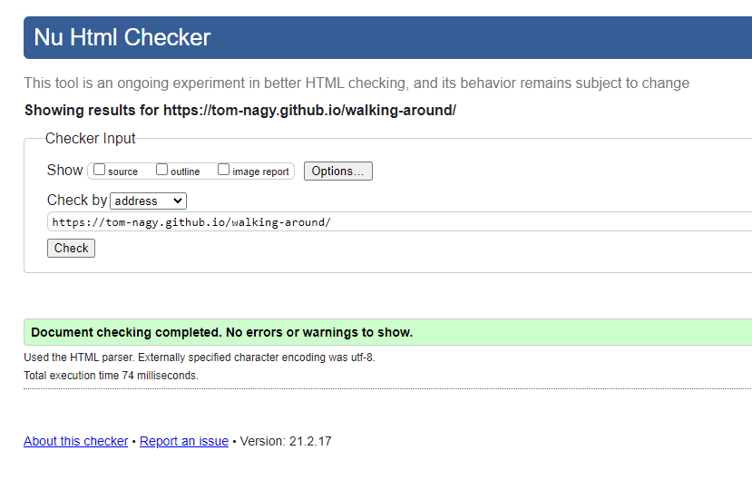
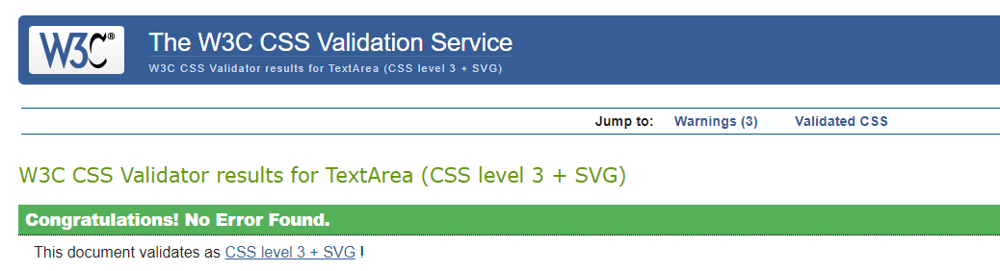
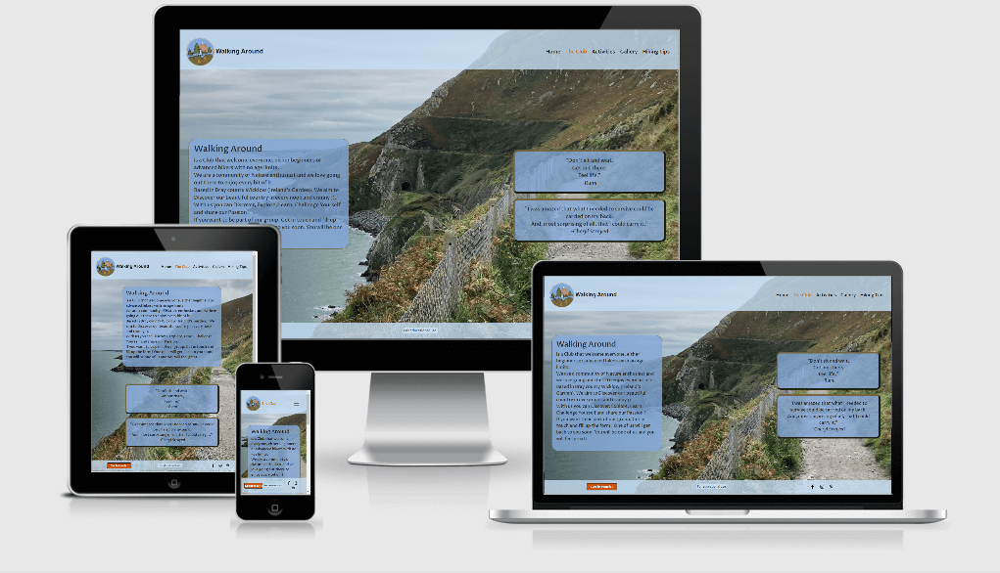
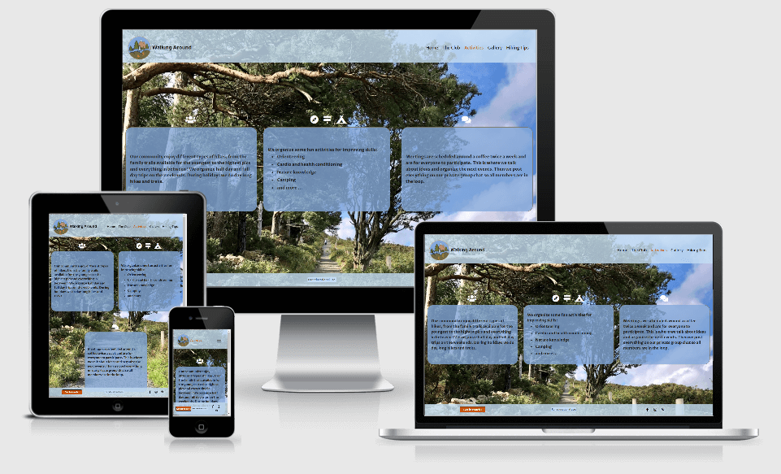
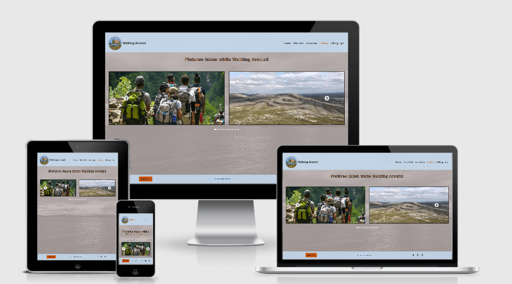
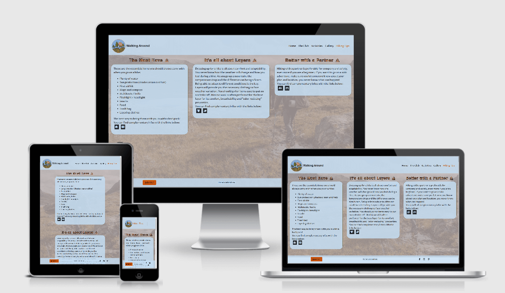
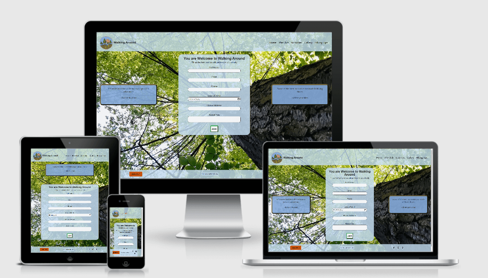
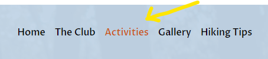
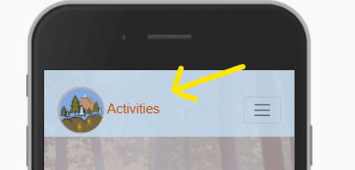
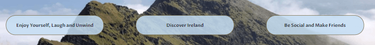

# **Walking Around**


**[README.md](README.md)**

**[Visit the live Website here](https://tom-nagy.github.io/walking-around/)**.

# Testing

## Table of Content : 

* [W3C](https://github.com/Tom-Nagy/walking-around/blob/master/TESTING.md#W3C)
* [Lighthouse](https://github.com/Tom-Nagy/walking-around/blob/master/TESTING.md#Lighthouse)
* [Cross Browsers Testing](https://github.com/Tom-Nagy/walking-around/blob/master/TESTING.md#Cross-Browsers-Testing)
    * [Manual Testing](https://github.com/Tom-Nagy/walking-around/blob/master/TESTING.md#Manual-Testing)
* [User Stories Testing from UX section of the README.md](https://github.com/Tom-Nagy/walking-around/blob/master/TESTING.md#User-Stories-Testing-from-UX-section-of-the-README.md)
    * [First Time User](https://github.com/Tom-Nagy/walking-around/blob/master/TESTING.md#First-Time-User)
    * [Returning User](https://github.com/Tom-Nagy/walking-around/blob/master/TESTING.md#Returning-User)
* [Further Testing](https://github.com/Tom-Nagy/walking-around/blob/master/TESTING.md#Further-Testing)

## W3C

W3C Markup Validation Service and W3C CSS Validation Service have been used to check all the pages of the website for semantic and syntax errors. 
The results are positive and the code is valid.

* [W3C Markup Validation Service](https://validator.w3.org/)


    
* [W3C CSS Validation Service](https://jigsaw.w3.org/css-validator/)




## Lighthouse

[Lighthouse](https://developers.google.com/web/tools/lighthouse/?utm_source=devtools) is a tool provided by Google Chrome DevTools and allows to 
identify the site performance, accessibility and user experience on Mobile and Desktop.  
All the pages from the website have been tested with Lighthouse. They all show 100% score except for the performance for some pages.

* Home 
    * [Mobile](assets/images/TESTING-images/lighthouse/home-mobile-test.png)
    * [Desktop](assets/images/TESTING-images/lighthouse/home-desktop-test.png)

* The Club
    * [Mobile](assets/images/TESTING-images/lighthouse/theclub-mobile-test.png)
    * [Desktop](assets/images/TESTING-images/lighthouse/theclub-desktop-test.png)

* Activities
    * [Mobile](assets/images/TESTING-images/lighthouse/activities-mobile-test.png)
    * [Desktop](assets/images/TESTING-images/lighthouse/activities-desktop-test.png)

* Gallery
    * [Mobile](assets/images/TESTING-images/lighthouse/gallery-mobile-test.png)
    * [Desktop](assets/images/TESTING-images/lighthouse/gallery-desktop-test.png)

* Hiking Tips
    * [Mobile](assets/images/TESTING-images/lighthouse/hikintips-mobile-test.png)
    * [Desktop](assets/images/TESTING-images/lighthouse/hikintips-desktop-test.png)

* Join Us !
    * [Mobile](assets/images/TESTING-images/lighthouse/join-mobile-test.png)
    * [Desktop](assets/images/TESTING-images/lighthouse/join-desktop-test.png)

## Cross Browsers Testing

The website was tested on severals browsers ( Google Chrome, Mozilla Firefox, Microsoft Edge, Safari, Opera) 
and shows good functionality across them all.  
Manual testing was executed on all browsers as shown in the following section.

### Manual Testing

The responsiveness of the website for different viewport sizes was tested by dragging the window up, down, 
left and right.  
The following tests have been executed severals times at different viewport breakpoints.

* Header
    * Click on ```The Club``` navigation link, and check if the link works, when hovered and stays highlighted while on 
    the page on medium and larger screens.
    * Click on ```Activities``` navigation link, and check if the link works, when hovered and stays highlighted while on 
    the page on medium and larger screens.
    * Click on ```Gallery``` navigation link, and check if the link works, when hovered and stays highlighted while on 
    the page on medium and larger screens.
    * Click on ```Hiking Tips``` navigation link, and check if the link works, when hovered and stays highlighted while on 
    the page on medium and larger screens.
    * Click on ```Home``` navigation link, and check if the link works, when hovered and stays highlighted while on 
    the page on medium and larger screens.
    * Click on ```the logo```, and check if the link works on all screens sizes.

    * The toggle menu's links on small screens have been tested as well.  

* Footer
    * Click on ```Join Us!``` navigation link (button), and check if the link works, when hovered as well.
    * Click on ```the Facebook icon``` link and check if the link works, when hovered and opens in a different tab.
    * Click on ```the Instagram icon``` link and check if the link works, when hovered and opens in a different tab.
    * Click on ```the Pinterest icon``` link and check if the link works, when hovered and opens in a different tab.

* Home 
    * Click on ```About Us``` navigation link (button), and check if the link works, when hovered as well.

* The Club
    * Not applicable.

* Activities
    * Not applicable.

* Gallery
    * Click on the arrows to change slides.
    * Click on the images and check if the modal appear with the corresponding information.
    * Click on the closing button of the modal to close it.
    * Click outside of the modal window to close it.

* Hiking Tips
    * Click on the download icons beside the titles and check if the link opens a pdf file in a different tab.
    * Click on the icons (links) at the end of every tips and check if the links work and open in a different tab.

* Join Us !
    * Try to submit the form without filling the :
        * Full Name input and check if the form is valid and that an error message appears.
        * Email input and check if the form is valid and that an error message appears.
        * Phone input and check if the form is valid and that an error message appears.
        * Date of Birth input and check if the form is valid and that an error message appears.
        * Home Address input and check if the form is valid and that an error message appears.
        * About You input and check if the form is valid and that an error message appears.
    * Try to submit the form given incorrect input for :
        * Email and check if the form is valid and that an error message appears.
        * Phone and check if the form is valid and that an error message appears.

## User Stories Testing from UX section of the README.md

### First Time User

1. As a first time user, I want the website to be appealing.
    * The website uses clean and spacious design.
    * The website applies all the accessibility protocols for an easy and good user experience for all.








See [Lighthouse](https://github.com/Tom-Nagy/walking-around/blob/master/TESTING.md#Lighthouse) for accessibility results.

2. As a first time user, I want the navigation to be easy and intuitive.
    * The header and the footer are fixed respectively on the top and on the bottom of the page and always 
    accessible. So it is easy and quick to navigate.
    * The navigation menu is clear.
    * The current page is highlighted on medium and large screens to provide feedback location information to the user.



    * The current page replace the website name beside the logo on small screens to provide feedback location information to the user.



3. As a first time user, I want the content to be informative but not overwhelming.
    * The content is displayed per readable and short sections to provide the feeling that it is approachable and 
    not complicated. This is supported by the website design.
    

4. As a first time user, I want to understand immediately what is the website about without the need 
of looking for it.
    * The home page provide all the information that a new user need :
        * The heading gives the main information: "Ireland Best Walking Community" which includes location, 
        and what it is about.


        * Three paragraphs give extra information about the community spirit and goals.




5. As a first time user, I want to be able to apply for joining the Club.
    * In the footer a button/link ```Join Us !``` is always visible and accessible.
    * The form gives information (on the top) on what to except. After filling up the form, someone will contact 
    the user.
    * Additional information is given in the "About Us" section of The Club page on how to join.

### Returning User

6. As a returning user, I want to see when and where are the Club's meetings.
    * Club's meeting policy is explained in the "Meet up" section of the Activities page. 

7. As a returning user, I want to check out the different social media links for inspiration and ideas.
    * Relevant social media links are provided in the fixed footer and always accessible.

8. As a returning user, I want to get information about hiking.
    * A page is dedicated to Hiking Tips which include three main tips.
    * Each tip is downloadable in a pdf format.
    * Additional information is available at the bottom of each tip's section in a form of a link to external 
    websites.

## Further Testing

* The website has been tested by fellow students, slack community, friends and family.
* All the issues raised have been addressed.